<div align="center">

# Fluxos da Previdência Complementar Aberta no Brasil (2014–2026)

### Contribuições, resgates e portabilidade de VGBL e PGBL por grupo econômico

**MVP — Construção de um Pipeline de Dados na Nuvem**

Disciplina: Engenharia de Dados  
Pós-Graduação em Ciência de Dados e Analytics  
Pontifícia Universidade Católica do Rio de Janeiro (PUC-Rio)

**Aluno(a):** Danilo Leandro Gomes dos Santos

Setembro de 2026

---

*Plataforma: Databricks Free Edition (Unity Catalog · Delta Lake · PySpark / Spark SQL)*  
*Fonte de dados: SUSEP — Sistema de Estatísticas da SUSEP (SES)*

</div>

## Glossário de siglas e termos

**Mercado de previdência**

| Sigla / termo | Significado |
|---|---|
| **SUSEP** | Superintendência de Seguros Privados — autarquia federal que regula e fiscaliza seguros, previdência complementar aberta e capitalização |
| **SES** | Sistema de Estatísticas da SUSEP — base pública de onde vêm todos os dados deste trabalho |
| **FIP** | Formulário de Informações Periódicas — relatório que as empresas supervisionadas enviam à SUSEP; é a origem dos dados do SES |
| **EAPP** | Entidade Aberta de Previdência Complementar — empresa autorizada a vender planos de previdência abertos ao público |
| **Previdência complementar aberta** | Planos de previdência privada vendidos ao público por seguradoras e EAPPs (diferente dos fundos de pensão fechados, ligados a uma empresa ou categoria) |
| **PGBL** | Plano Gerador de Benefício Livre — plano de previdência cujas contribuições podem ser deduzidas da base do IR (até 12% da renda bruta, na declaração completa); o IR incide sobre o valor total resgatado |
| **VGBL** | Vida Gerador de Benefício Livre — seguro de pessoas com cobertura por sobrevivência; não há dedução no IR, e o imposto incide apenas sobre os rendimentos |
| **PAGP, PRGP, VAGP, VRGP** | Modalidades menos comuns de planos (P = previdência, V = vida) com atualização ou remuneração garantida; aparecem nos dados de portabilidade, mas ficaram fora do escopo |
| **Previdência tradicional** | Planos antigos com rentabilidade mínima garantida; fora do escopo deste MVP |
| **Contribuição** | Valor aportado pelo participante no plano (entrada de recursos) |
| **Resgate** | Retirada de recursos pelo participante antes ou em vez de receber um benefício (saída de recursos); pode ser total ou parcial |
| **Benefício** | Pagamento de renda ao participante na fase de recebimento (aposentadoria, pensão) |
| **Portabilidade** | Transferência da reserva acumulada de um plano para outro, geralmente entre empresas diferentes, sem resgate e sem incidência de IR. **Aceita** = recebida pela empresa; **cedida** = enviada |
| **PMBaC** | Provisão Matemática de Benefícios a Conceder — reserva acumulada pelos participantes que ainda não recebem benefício; é o "estoque" de recursos do plano |
| **Grupo econômico** | Conjunto de empresas sob o mesmo controle (ex.: todas as seguradoras de um mesmo banco) |
| **Código 99999** | Código genérico usado pela SUSEP para empresas classificadas como "OUTROS GRUPOS"; não representa um grupo real |
| **IOF** | Imposto sobre Operações Financeiras — citado no contexto das mudanças tributárias sobre aportes em VGBL em 2025 |

**Métricas definidas neste trabalho**

| Sigla / termo | Significado |
|---|---|
| **FLCR** | Fluxo Líquido de Contribuições e Resgates = contribuições − resgates |
| **Saldo líquido de portabilidade** | Portabilidade aceita − portabilidade cedida |
| **Captação líquida** | FLCR + saldo líquido de portabilidade (conceito usado pelo mercado) |
| **Taxa de resgate** | Resgates do período ÷ PMBaC média do período |
| **HHI** | Índice Herfindahl-Hirschman — medida de concentração de mercado: soma dos quadrados das participações (em %) de cada grupo; vai de 0 (pulverizado) a 10.000 (monopólio) |
| **Top-5** | Participação somada dos 5 maiores grupos no mercado |
| **Unidade econômica** | Grupo econômico vigente no mês ou, para empresas do código 99999, a própria empresa |
| **YTD / jan–jul** | *Year to date* — acumulado de janeiro a julho, usado para comparar 2026 (ano incompleto) com os anos anteriores |

**Termos técnicos**

| Sigla / termo | Significado |
|---|---|
| **AAAAMM** | Formato de data usado no SES: ano com 4 dígitos + mês com 2 dígitos (ex.: 202507 = julho de 2025) |
| **Bronze / Silver / Gold** | Camadas da arquitetura medalhão: dado bruto → dado limpo e padronizado → dado modelado para análise |
| **Delta Lake** | Formato de tabela usado pelo Databricks, com transações ACID e histórico de versões |
| **Unity Catalog** | Catálogo de dados do Databricks: organiza tabelas, comentários, permissões e linhagem |
| **PK / FK** | *Primary Key* (chave primária) / *Foreign Key* (chave estrangeira) |
| **Linhagem (*lineage*)** | Rastro de origem de cada tabela: de quais tabelas ela foi gerada |
| **Quarentena** | Tabela onde ficam os registros que não puderam ser interpretados com segurança, preservados sem descarte |
---

Pipeline de dados construído no **Databricks Free Edition** (Unity Catalog + Delta Lake + PySpark/Spark SQL), organizado na arquitetura medalhão **Bronze → Silver → Gold**, a partir da base pública do **SES — Sistema de Estatísticas da SUSEP**.

| Notebook | Conteúdo |
|---|---|
| [`notebooks/01_bronze.py`](notebooks/01_bronze.py) | Ingestão dos 9 CSVs do Volume para tabelas Delta, sem transformação, com metadados de rastreabilidade |
| [`notebooks/02_silver_qualidade.py`](notebooks/02_silver_qualidade.py) | Diagnóstico e tratamento dos problemas de qualidade; tabelas Silver; quarentena; testes |
| [`notebooks/03_gold_modelo_catalogo.py`](notebooks/03_gold_modelo_catalogo.py) | Esquema estrela, PK/FK, testes da Gold e catálogo de dados |
| [`notebooks/04_analises.py`](notebooks/04_analises.py) | Consultas e visualizações que respondem às perguntas de negócio |

Execução: sequencial, 01 → 02 → 03 → 04, no Databricks (catálogo `previdencia`, schemas `bronze`, `silver`, `gold`).

---

## 1. Contexto de Negócios e Perguntas (Etapa 2 e 4.1)

### Contexto
A previdência complementar aberta reúne planos oferecidos por seguradoras e entidades abertas de previdência (EAPP), supervisionadas pela SUSEP. Os dois produtos dominantes são o **VGBL** (seguro de pessoas com cobertura por sobrevivência) e o **PGBL** (plano de previdência). Juntos, eles acumulam da ordem de R$ 1,8 trilhão em provisões e movimentam centenas de bilhões de reais por ano em contribuições, resgates e portabilidades.

A SUSEP publica esses dados no SES, a partir dos Formulários de Informações Periódicas (FIP) enviados pelas empresas. Os dados são públicos, mas chegam fragmentados em dezenas de arquivos, com:
- encoding Windows-1252;
- vírgula decimal;
- chaves com espaços;
- mudança de granularidade ao longo do tempo;
- duplicatas;
- domínios não documentados;
- grupo econômico ausente do cadastro;
- divergências entre tabelas.

### Problema
Não existe uma base integrada e auditável que permita acompanhar **entradas e saídas de recursos de VGBL e PGBL** e **distribuí-las entre grupos econômicos** com métricas definidas explicitamente. Comparar os arquivos do SES diretamente leva a erros de soma (sub-linhas e duplicatas), de atribuição (grupo econômico muda no tempo) e de interpretação (portabilidade misturada a contribuição).

### Objetivo geral
Construir, no Databricks, um pipeline Bronze → Silver → Gold reprodutível sobre o SES/SUSEP que responda às perguntas abaixo.

### Objetivos específicos
1. Ingerir os arquivos preservando o original, com metadados de rastreabilidade.
2. Diagnosticar e tratar, de forma documentada, os problemas de qualidade.
3. Integrar contribuições, resgates, portabilidade, provisões e grupo econômico com atribuição temporal.
4. Modelar um esquema estrela com catálogo de dados.
5. Responder às perguntas com Spark SQL.

### Perguntas de negócio
| # | Pergunta |
|---|---|
| Q1 | Como evoluíram contribuições, resgates e FLCR (contribuições − resgates) de VGBL e PGBL de 2014 a 2025, e como jan–jul/2026 se compara a jan–jul dos anos anteriores? |
| Q2 | Como evoluiu a taxa de resgate (resgates ÷ PMBaC média) de VGBL e PGBL? |
| Q3 | Qual o grau de concentração das contribuições entre grupos econômicos (participação dos 5 maiores e HHI), por produto e ano? |
| Q4 | Qual o saldo líquido de portabilidade por grupo econômico (unidade econômica) e qual a sua magnitude relativa às contribuições? |
| Q5 | Em que medida o resultado e a posição dos grupos mudam quando se passa do FLCR para a captação líquida (FLCR + saldo líquido de portabilidade)? |

### Definições das métricas
| Métrica | Fórmula | Origem | Grão | Limitações |
|---|---|---|---|---|
| Contribuições | Σ `contrib` (`tipoProd` ∈ {VGBL, PGBL}) | `Ses_Contrib_Benef` | empresa × mês × produto | Valores nominais |
| Resgates | Σ (`resg_total` + `resg_parcial`) após remover duplicatas exatas e somar as sub-linhas | `Ses_vgbl_resgates`, `ses_pgbl_resgates` | empresa × mês × produto | Sub-linhas pós-12/2013 não identificadas; `Resg_Pag_programado` (não documentado) fora da soma |
| **FLCR** (fluxo líquido de contribuições e resgates) | Contribuições − Resgates | acima | agregável | Não inclui portabilidade, benefícios, rentabilidade; não é variação da reserva |
| **Saldo líquido de portabilidade** | Aceita (`TIPOTRANSF`=R) − Cedida (`TIPOTRANSF`=D) | `ses_transferenciasexternas` (`TIPOPLANO` ∈ {VGBL, PGBL}) | empresa/grupo × produto × período | Direção R/D confirmada no SES online; tende a ~0 no agregado do mercado |
| **Captação líquida** | FLCR + Saldo líquido de portabilidade | acima | empresa/grupo × período | Conceito de mercado (relatórios baseados no SES), não definição normativa; exclui benefícios |
| **Taxa de resgate** | Σ resgates do período ÷ média dos saldos mensais de PMBaC | resgates + `Ses_vgbl_fundos`, `ses_pgbl_fundos` | produto × ano | Denominador afetado por rentabilidade e portabilidade; 2026 só jan–jul |
| **HHI** | Σ (participação × 100)² das contribuições | contribuições + grupo | produto × ano | Empresas do grupo 99999 ("outros") ou sem grupo contam como unidades próprias |

**Unidade econômica (Q3, Q4, Q5):** o grupo econômico vigente no mês. Quando a empresa está no código genérico 99999 ("OUTROS GRUPOS") da SUSEP, que não é um grupo real, a própria empresa é a unidade, identificada como "(sem grupo)".

**Período:** jan/2014 a jul/2026. 2014 é o primeiro ano completo após a mudança de granularidade de 12/2013. Anos completos: 2014–2025. **2026 só é comparado em base jan–jul.**

### Dados brutos, estrutura e licença
**Fonte:** SUSEP — SES, *Base de Dados do SES* (`BaseCompleta.zip`), gerada em 21/09/2026, dados até 07/2026 — https://www2.susep.gov.br/menuestatistica/ses/principal.aspx. Documentação oficial das tabelas: `Documentacao_das_tabelas.rtf` (mesma página).

**Licença:** a página do SES informa que o sistema tem "o objetivo de fornecer ao público em geral estatísticas dos mercados supervisionados pela SUSEP". O download não traz um arquivo de licença específico. Os dados são publicados por órgão federal no âmbito da Política de Dados Abertos do Poder Executivo federal (Decreto nº 8.777/2016). O uso neste trabalho é acadêmico, não comercial, com citação da fonte. Os dados **não** são redistribuídos neste repositório.

| Arquivo | Linhas* | Colunas (originais) | Conteúdo |
|---|---|---|---|
| `Ses_Contrib_Benef.csv` | 28.185 | coenti, damesano, tipoProd, contrib, benef | Contribuições e benefícios por produto |
| `Ses_vgbl_resgates.csv` | 19.682 | damesano, coenti, resg_total, resg_parcial, Resg_Pag_programado | Resgates VGBL |
| `ses_pgbl_resgates.csv` | 18.016 | idem | Resgates PGBL |
| `ses_transferenciasexternas.csv` | 17.746 | COENTI, DAMESANO, TIPOTRANSF, TIPOPLANO, VALOR, QUANTIDADE | Portabilidades externas |
| `Ses_vgbl_fundos.csv` | 6.184 | coenti, damesano, fundos | PMBaC VGBL (fundos) |
| `ses_pgbl_fundos.csv` | 7.122 | coenti, damesano, fundos | PMBaC PGBL (fundos) |
| `ses_pgbl_uf.csv` | 129.216 | COENTI, DAMESANO, UF, CONTRIB, BENEFPAGO, RESGPAGO, NUMPARTIC, NUMBENEF, NUMRESG | PGBL por UF (somente conciliação) |
| `Ses_cias.csv` | 769 | Coenti, Noenti, Cogrupo, Nogrupo | Cadastro de empresas |
| `Ses_grupos_economicos.csv` | 66.461 | damesano, coenti, noenti, cogrupo, nogrupo | Grupo econômico por empresa e mês |

\* contagens confirmadas no notebook 01 (linhas no arquivo = linhas na tabela Bronze para os 9 arquivos).

---

## 2. Carga dos Dados (Etapa 4.2)

1. Download manual do `BaseCompleta.zip` na página do SES, em 26/09/2026, e descompactação local. O ZIP contém 40 CSVs. **9 foram selecionados** para o escopo.
2. Upload dos 9 CSVs para o **Volume do Unity Catalog** `/Volumes/previdencia/bronze/raw/ses/` pela interface do Databricks. O Free Edition restringe o acesso de saída à internet, e o upload para Volume é o caminho documentado pela plataforma.
3. O notebook [`01_bronze.py`](notebooks/01_bronze.py) lê cada CSV com `sep=';'`, `encoding=windows-1252` e todas as colunas como texto. Ele grava tabelas Delta em `previdencia.bronze.*` e acrescenta os metadados `_arquivo_origem`, `_data_geracao_base_ses`, `_mes_referencia_max`, `_ts_ingestao` e `_hash_linha`.
4. Teste de completude da carga: nº de linhas de cada tabela = nº de linhas de dados do arquivo.

**Volume com os arquivos brutos**
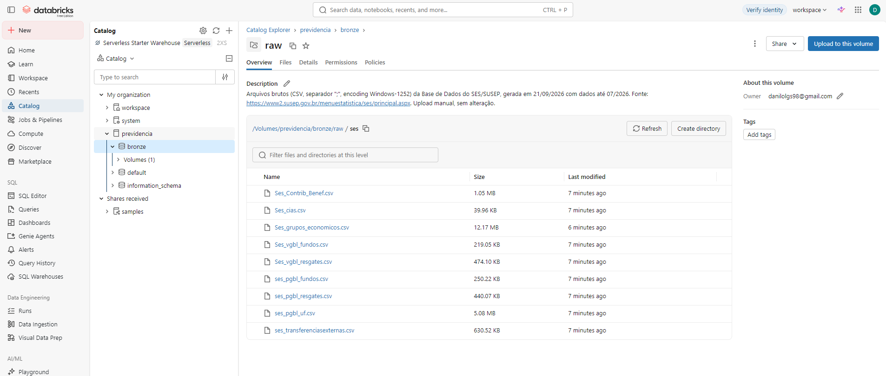

**Contagem de linhas: arquivo × tabela Bronze (9/9 OK)**
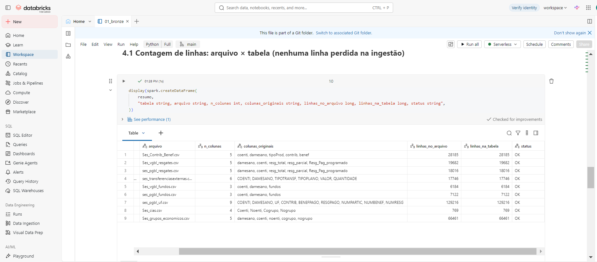

**Schema de uma tabela Bronze (colunas de negócio como string + metadados; formato Delta)**
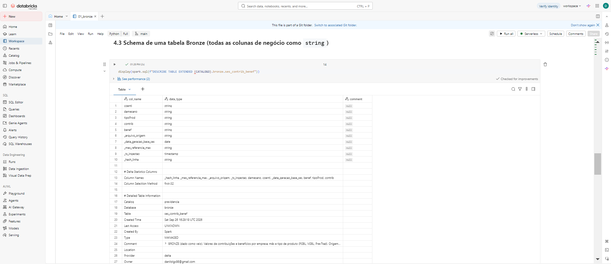

---

## 3. Modelagem e Catálogo de Dados (Etapa 4.3)

### 3.1 Modelo — esquema estrela com associação temporal de grupo
```
                          dim_tempo (mes_ref)
                                 │ 1:N
 dim_empresa ──1:N──►  fato_fluxo_previdencia  ◄──N:1── dim_produto
 (cod_empresa)        (mes_ref, cod_empresa, cod_produto)   (cod_produto)
       │                         │ N:1
       │ 1:N                dim_grupo (cod_grupo)
       ▼                         ▲ N:1
 ponte_empresa_grupo_mes ────────┘   (grupo vigente para cada empresa em cada mês)

 fato_pmbac (mes_ref, cod_empresa, cod_produto) → mesmas dimensões (tempo, empresa, produto, grupo)
```

| Tabela | Tipo | Grão | PK | FKs | Linhas |
|---|---|---|---|---|---|
| `fato_fluxo_previdencia` | fato de fluxos (mensal) | mês × empresa × produto | mes_ref, cod_empresa, cod_produto | tempo, empresa, produto, grupo | 6.664 |
| `fato_pmbac` | fato *snapshot* (estoque de fim de mês) | mês × empresa × produto | mes_ref, cod_empresa, cod_produto | tempo, empresa, produto, grupo | — |
| `ponte_empresa_grupo_mes` | associação temporal | empresa × mês | cod_empresa, mes_ref | empresa, grupo, tempo | 3.732 |
| `dim_tempo` | dimensão | mês (jan/2014–jul/2026) | mes_ref | — | 151 |
| `dim_produto` | dimensão | produto | cod_produto | — | 2 |
| `dim_empresa` | dimensão | empresa | cod_empresa | — | 769 |
| `dim_grupo` | dimensão | grupo econômico | cod_grupo | — | 122 |

**Decisões de modelagem**
- **Um único fato de fluxo.** Contribuições, resgates e portabilidade têm exatamente o mesmo grão (mês × empresa × produto), e as métricas derivadas combinam as três: FLCR = contribuições − resgates; captação líquida = FLCR + saldo de portabilidade. Separá-las em três fatos obrigaria a *joins* entre fatos em todas as consultas. A junção é um *full outer* das chaves das três origens, e as *flags* `fl_tem_contribuicao`, `fl_tem_resgate` e `fl_tem_portabilidade` indicam de onde veio cada valor.
- **Fato de estoque separado.** A PMBaC é uma fotografia de fim de mês (não é aditiva no tempo), por isso fica em `fato_pmbac`, com o mesmo grão e as mesmas dimensões.
- **Grupo econômico com atribuição temporal.** 175 empresas do mercado (74 das 124 de previdência) mudaram de grupo ao longo do histórico. Alguns exemplos reais: a empresa 05843 passou por Liberty, Talanx, Indiana, Bradesco e Independente, e 06238/05665/06181 passaram por Vera Cruz → MAPFRE → BBMAPFRE. Atribuir todo o histórico ao grupo atual distorceria a concentração e os rankings. A `ponte_empresa_grupo_mes` resolve, para cada empresa × mês, o grupo **vigente no mês** (*as-of join*: o último grupo informado com mês ≤ mês do fato). O fato carrega esse `cod_grupo` como FK. Resultado: **3.731 atribuições EXATAS, 1 HERDADA (1 mês de defasagem) e 0 NAO_INFORMADO**.
- **Chaves no Unity Catalog.** Foram criadas **7 PKs e 11 FKs** como *constraints* informativas. A validade delas é garantida pelos testes da Gold (unicidade e órfãos = 0).

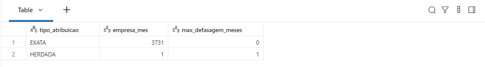
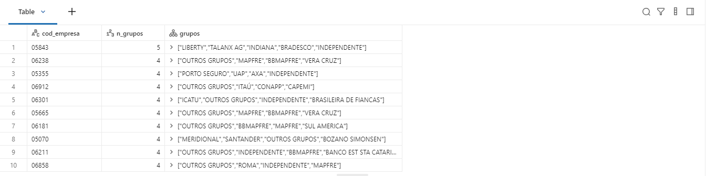

### 3.2 Catálogo de dados
O catálogo foi construído em três formas complementares:
1. **`COMMENT` em cada tabela e coluna no Unity Catalog**, visível no Catalog Explorer, com descrição e linhagem da tabela;
2. **tabela `gold.catalogo_dados`**, gerada automaticamente no notebook 03. Para cada coluna das camadas Silver e Gold, ela registra descrição, tipo, **domínio observado calculado a partir dos dados** (mínimo/máximo para números e datas; categorias para textos) e % de nulos. Exportada em [`docs/evidencias/catalogo_dados_gold.csv`](docs/evidencias/catalogo_dados_gold.csv);
3. **linhagem**: descrita no comentário de cada tabela e capturada **automaticamente pelo Unity Catalog** (grafo abaixo).

**Catálogo transcrito — modelo Gold**

#### `gold.fato_fluxo_previdencia`
*Fato de fluxos mensais por empresa e produto: contribuições, resgates, FLCR, portabilidade e captação líquida.*  
**Linhagem:** silver.contribuicoes ⟗ silver.resgates ⟗ silver.portabilidade + ponte_empresa_grupo_mes; jan/2014–jul/2026.

| Coluna | Descrição | Tipo | Domínio observado | % nulos |
|---|---|---|---|---|
| `cod_empresa` | Código FIP da empresa na SUSEP (5 dígitos, texto). | string | 30 valores distintos (ex.: 01848, 02101, 02682 ...) | 0 |
| `cod_grupo` | Código do grupo econômico (99999 = 'OUTROS GRUPOS', genérico; NAO_INFORMADO = sem histórico). | string | 21 valores distintos (ex.: 00019, 00027, 00035 ...) | 0 |
| `cod_produto` | Produto: VGBL ou PGBL. | string | {PGBL, VGBL} | 0 |
| `fl_contribuicao_negativa` | Verdadeiro se a contribuição informada é negativa (estorno/ajuste). Mantida nos totais. | boolean | {false} | 0 |
| `fl_qtd_portab_suspeita` | Verdadeiro se alguma linha de origem tem valor médio por portabilidade < R$ 100 (QUANTIDADE implausível). | boolean | {false, true} | 0 |
| `fl_tem_contribuicao` | Verdadeiro se a chave existe em silver.contribuicoes. | boolean | {false, true} | 0 |
| `fl_tem_portabilidade` | Verdadeiro se a chave existe em silver.portabilidade. | boolean | {false, true} | 0 |
| `fl_tem_resgate` | Verdadeiro se a chave existe em silver.resgates. | boolean | {false, true} | 0 |
| `mes_ref` | Mês de referência (1º dia do mês), derivado de damesano (AAAAMM). | date | [2014-01-01 ; 2026-07-01] | 0 |
| `vl_captacao_liquida` | Captação líquida (conceito de mercado) = vl_flcr + vl_portab_liquida. | decimal(20,2) | [-4038109018.01 ; 4196870481.15] | 0 |
| `vl_contribuicao` | Contribuições no mês (R$ nominais). Origem: contrib. | decimal(20,2) | [0.00 ; 6277450353.05] | 0 |
| `vl_flcr` | FLCR — fluxo líquido de contribuições e resgates = vl_contribuicao − vl_resgate. | decimal(20,2) | [-1666920581.58 ; 4312297996.99] | 0 |
| `vl_portab_aceita` | Portabilidade aceita/recebida (TIPOTRANSF = R), R$ nominais. | decimal(20,2) | [-780180.94 ; 2757725563.85] | 0 |
| `vl_portab_cedida` | Portabilidade cedida/enviada (TIPOTRANSF = D), R$ nominais. | decimal(20,2) | [0.00 ; 2564267466.43] | 0 |
| `vl_portab_liquida` | Saldo líquido de portabilidade = aceita − cedida. | decimal(20,2) | [-2371188436.43 ; 2470579552.31] | 0 |
| `vl_resgate` | Resgates do projeto = resg_total + resg_parcial (R$ nominais). | decimal(20,2) | [0.00 ; 4527735624.30] | 0 |
| `vl_resgate_pag_programado` | Soma de Resg_Pag_programado (coluna não documentada pela SUSEP); fora de vl_resgate. | decimal(20,2) | [0.00 ; 1236136.78] | 0 |

#### `gold.fato_pmbac`
*Fato de estoque de PMBaC de fim de mês por empresa e produto.*  
**Linhagem:** silver.pmbac + ponte_empresa_grupo_mes; jan/2014–jul/2026.

| Coluna | Descrição | Tipo | Domínio observado | % nulos |
|---|---|---|---|---|
| `cod_empresa` | Código FIP da empresa na SUSEP (5 dígitos, texto). | string | 29 valores distintos (ex.: 01848, 02101, 02682 ...) | 0 |
| `cod_grupo` | Código do grupo econômico (99999 = 'OUTROS GRUPOS', genérico; NAO_INFORMADO = sem histórico). | string | 20 valores distintos (ex.: 00019, 00027, 00035 ...) | 0 |
| `cod_produto` | Produto: VGBL ou PGBL. | string | {PGBL, VGBL} | 0 |
| `mes_ref` | Mês de referência (1º dia do mês), derivado de damesano (AAAAMM). | date | [2014-01-01 ; 2026-07-01] | 0 |
| `vl_pmbac` | Provisão Matemática de Benefícios a Conceder aplicada em fundos, saldo de fim de mês (R$ nominais). | decimal(20,2) | [0.00 ; 434631324006.13] | 0 |

#### `gold.ponte_empresa_grupo_mes`
*Grupo vigente para cada empresa em cada mês (atribuição as-of).*  
**Linhagem:** chaves dos fatos × silver.empresa_grupo_mensal (último grupo com mês ≤ mês do fato).

| Coluna | Descrição | Tipo | Domínio observado | % nulos |
|---|---|---|---|---|
| `cod_empresa` | Código FIP da empresa na SUSEP (5 dígitos, texto). | string | 30 valores distintos (ex.: 01848, 02101, 02682 ...) | 0 |
| `cod_grupo` | Código do grupo econômico (99999 = 'OUTROS GRUPOS', genérico; NAO_INFORMADO = sem histórico). | string | 21 valores distintos (ex.: 00019, 00027, 00035 ...) | 0 |
| `mes_ref` | Mês de referência (1º dia do mês), derivado de damesano (AAAAMM). | date | [2014-01-01 ; 2026-07-01] | 0 |
| `meses_defasagem` | Meses entre o mês do fato e o mês do grupo utilizado (0 = exata). | int | [0 ; 1] | 0 |
| `tipo_atribuicao` | EXATA (grupo do próprio mês), HERDADA (último grupo anterior) ou NAO_INFORMADO. | string | {EXATA, HERDADA} | 0 |

#### `gold.dim_tempo`
*Dimensão de meses de jan/2014 a jul/2026.*  
**Linhagem:** Gerada por sequence(); flags de ano completo e de período YTD (jan–jul).

| Coluna | Descrição | Tipo | Domínio observado | % nulos |
|---|---|---|---|---|
| `ano` | Ano civil. | int | [2014 ; 2026] | 0 |
| `ano_mes` | Mês de referência no formato original AAAAMM. | string | 151 valores distintos (ex.: 201401, 201402, 201403 ...) | 0 |
| `fl_ano_completo` | Verdadeiro para anos com 12 meses na base (2014–2025). | boolean | {false, true} | 0 |
| `fl_periodo_ytd` | Verdadeiro para meses jan–jul (base de comparação com 2026). | boolean | {false, true} | 0 |
| `mes` | Mês (1–12). | int | [1 ; 12] | 0 |
| `mes_ref` | Mês de referência (1º dia do mês), derivado de damesano (AAAAMM). | date | [2014-01-01 ; 2026-07-01] | 0 |
| `trimestre` | Trimestre (1–4). | int | [1 ; 4] | 0 |

#### `gold.dim_produto`
*Dimensão de produtos do escopo (VGBL, PGBL).*  
**Linhagem:** Definida no notebook 03.

| Coluna | Descrição | Tipo | Domínio observado | % nulos |
|---|---|---|---|---|
| `cod_produto` | Produto: VGBL ou PGBL. | string | {PGBL, VGBL} | 0 |
| `descricao_produto` | Descrição do produto. | string | {Plano de previdência complementar aberta; contribuições dedutíveis da base do IR (decl… | 0 |
| `nome_produto` | Nome do produto. | string | {Plano Gerador de Benefício Livre, Vida Gerador de Benefício Livre} | 0 |

#### `gold.dim_empresa`
*Dimensão de empresas.*  
**Linhagem:** silver.empresa.

| Coluna | Descrição | Tipo | Domínio observado | % nulos |
|---|---|---|---|---|
| `cod_empresa` | Código FIP da empresa na SUSEP (5 dígitos, texto). | string | 769 valores distintos (ex.: 01007, 01015, 01058 ...) | 0 |
| `nome_empresa` | Razão social da empresa (Ses_cias). | string | 750 valores distintos (ex.: 180 SEGUROS S.A., 2P SEGUROS S.A., 88I SEGURADORA DIGITAL S… | 0 |

#### `gold.dim_grupo`
*Dimensão de grupos econômicos (nome mais recente) + NAO_INFORMADO.*  
**Linhagem:** silver.empresa_grupo_mensal.

| Coluna | Descrição | Tipo | Domínio observado | % nulos |
|---|---|---|---|---|
| `cod_grupo` | Código do grupo econômico (99999 = 'OUTROS GRUPOS', genérico; NAO_INFORMADO = sem histórico). | string | 122 valores distintos (ex.: 00019, 00027, 00035 ...) | 0 |
| `fl_grupo_generico` | Verdadeiro para o código 99999 (não é um grupo real; no HHI cada empresa conta como unidade própria). | boolean | {false, true} | 0 |
| `nome_grupo` | Nome do grupo econômico. | string | 122 valores distintos (ex.: ACE, AGF BRASIL, ALFA ...) | 0 |

**Observações sobre domínios**
- `fl_contribuicao_negativa` tem domínio `{false}` na Gold. As 2 contribuições negativas de VGBL/PGBL da Silver são anteriores a 2014, ou seja, ficam fora do período do modelo.
- `vl_portab_aceita` tem mínimo negativo (−R$ 780 mil): é um dos 5 valores negativos de portabilidade (estornos), mantidos e sinalizados na Silver.
- `dim_empresa` e `dim_grupo` trazem o cadastro completo do mercado. Os fatos usam 30 empresas e 21 grupos.

**Unity Catalog: colunas com comentários e PK/FK na interface**
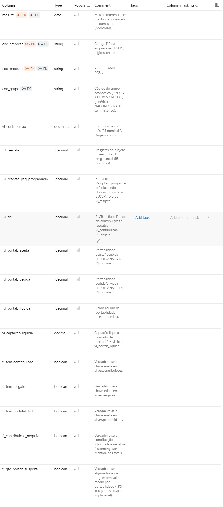

**Linhagem capturada automaticamente pelo Unity Catalog** (`silver.contribuicoes`, `silver.resgates`, `silver.portabilidade` e `gold.ponte_empresa_grupo_mes` → `gold.fato_fluxo_previdencia`)
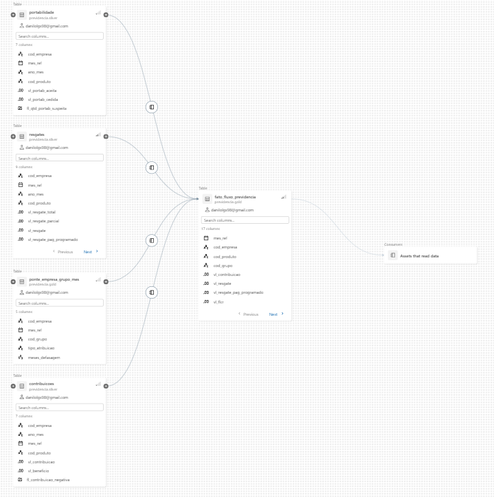

**Detalhes e propriedades Delta da tabela fato**
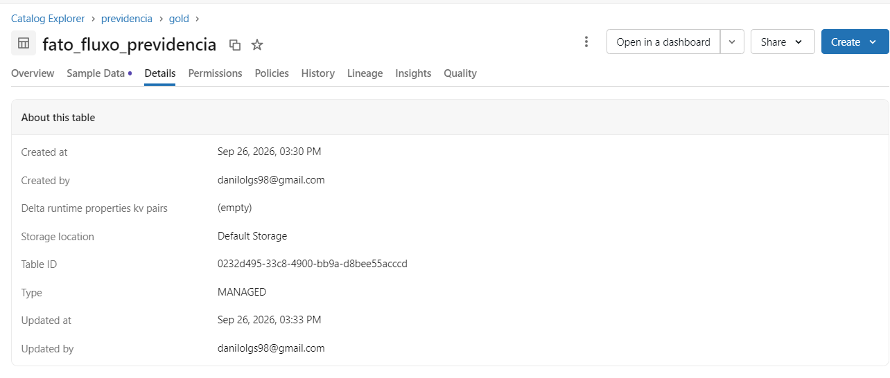
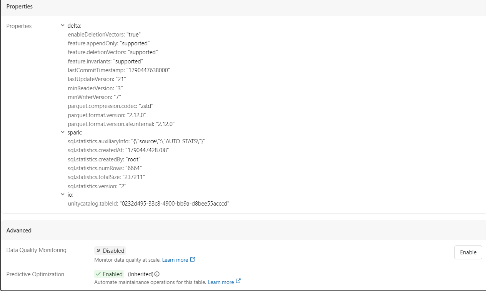

**Constraints PK/FK criadas** (CSV: [`docs/evidencias/constraints_gold.csv`](docs/evidencias/constraints_gold.csv); DESCRIBE completo: [`docs/evidencias/describe_fato_fluxo_previdencia.csv`](docs/evidencias/describe_fato_fluxo_previdencia.csv))
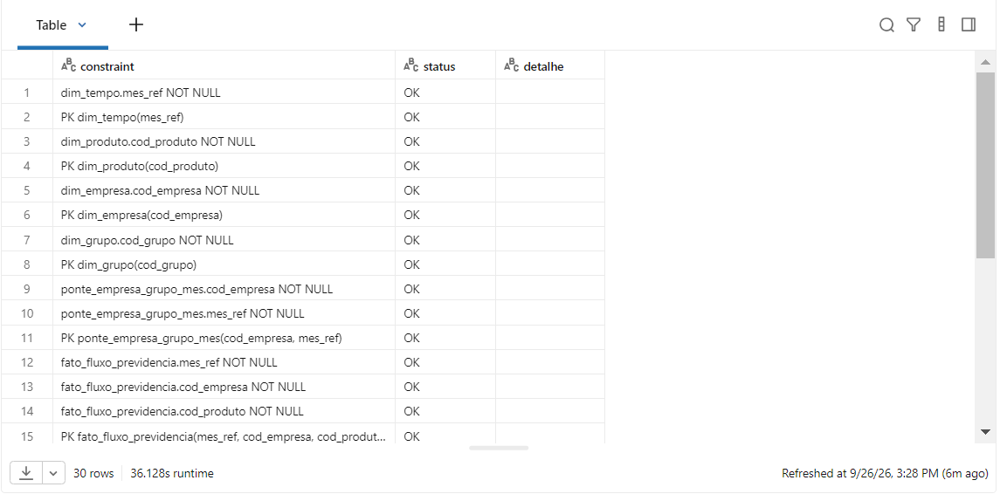

---

## 4. Pipeline de Dados (Etapa 4.4)

O pipeline foi organizado em **quatro notebooks**, executados em sequência no Databricks (computação *serverless*). Cada um lê apenas as tabelas da camada anterior e grava tabelas **Delta** gerenciadas pelo Unity Catalog, no catálogo `previdencia`. Todos os notebooks são idempotentes (sobrescrevem as tabelas da sua camada) e podem ser reexecutados do início.

| Etapa | Notebook | Entrada | Saída | Principais transformações |
|---|---|---|---|---|
| Ingestão | [`01_bronze.py`](notebooks/01_bronze.py) | 9 CSVs no Volume | `bronze.*` (9 tabelas) | nenhuma no conteúdo; leitura `windows-1252`/`;`; metadados de ingestão; teste de contagem arquivo × tabela |
| Limpeza e qualidade | [`02_silver_qualidade.py`](notebooks/02_silver_qualidade.py) | `bronze.*` | `silver.empresa`, `empresa_grupo_mensal`, `contribuicoes`, `resgates`, `portabilidade`, `pmbac`, `dq_conciliacao_pgbl`, `dq_resultados`, `quarentena` | trim; padronização de nomes; vírgula→ponto; `DECIMAL(20,2)`; AAAAMM→`DATE`; remoção de duplicatas exatas (com prova de soma zero); agregação das sub-linhas pós-12/2013; união VGBL+PGBL; mapeamento R/D; *flags*; quarentena; 59 testes |
| Modelagem | [`03_gold_modelo_catalogo.py`](notebooks/03_gold_modelo_catalogo.py) | `silver.*` | `dim_*`, `ponte_empresa_grupo_mes`, `fato_fluxo_previdencia`, `fato_pmbac`, `catalogo_dados` | *as-of join* do grupo; *full outer* das métricas; FLCR e captação líquida; PK/FK; 24 testes (unicidade, integridade, conservação de totais); `COMMENT`s |
| Consumo | [`04_analises.py`](notebooks/04_analises.py) | `gold.*` | consultas e gráficos | agregações anuais, jan–jul e mensais; taxa de resgate; HHI; rankings |

**Exemplos de transformações documentadas**
- *"Uni `ses_vgbl_resgates` e `ses_pgbl_resgates` com a coluna `cod_produto`, removi 15.029 duplicatas exatas após verificar que a soma removida era R$ 0,00 e somei as sub-linhas por empresa × mês × produto, porque a partir de 12/2013 a fonte passou a entregar até 3 linhas por chave sem coluna que as diferencie."*
- *"Fiz um* as-of join *das chaves dos fatos com `silver.empresa_grupo_mensal` para atribuir a cada fluxo o grupo econômico vigente no mês, porque 175 empresas mudaram de grupo ao longo do tempo."*
- *"Fiz* full outer join *de contribuições, resgates e portabilidade pela chave mês × empresa × produto, porque há meses em que uma empresa tem resgate ou portabilidade sem contribuição. O teste de conservação confirma que os totais da Gold são idênticos aos da Silver (diferença R$ 0,00 nas 5 métricas)."*

**Tabelas persistidas**
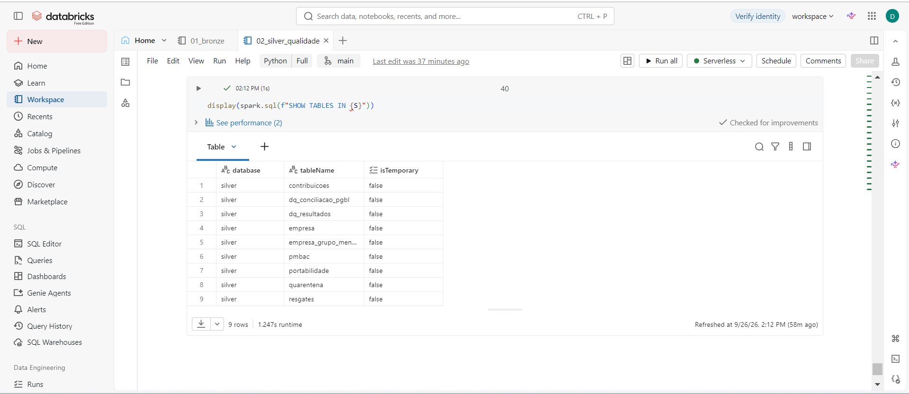
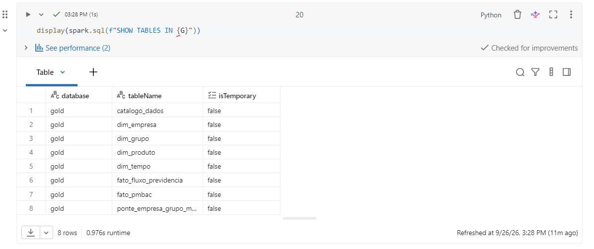

**Testes da Gold: 24/24 OK** (unicidade das PKs, integridade das FKs, conservação dos totais Silver → Gold e completude da atribuição de grupo). CSV: [`docs/evidencias/dq_resultados_gold.csv`](docs/evidencias/dq_resultados_gold.csv)
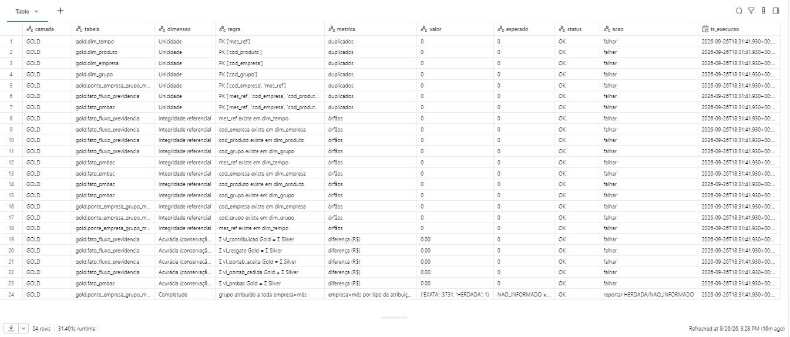

---

## 5. Qualidade de Dados (Etapa 4.5)

A qualidade foi tratada como parte do pipeline. Cada problema foi **diagnosticado com evidência antes de ser tratado**. Nenhum valor foi alterado silenciosamente: os registros não interpretáveis vão para `silver.quarentena`, e os valores atípicos legítimos são **mantidos e sinalizados** com flags.

Todos os testes ficam gravados em `silver.dq_resultados` (camada, tabela, dimensão, regra, métrica, valor, esperado, status, ação). A execução completa gerou **59 testes na Silver: 27 OK, 25 ALERTA (problema real da fonte, tratado e documentado) e 7 INFO**, e **nenhuma FALHA**. O arquivo exportado está em [`docs/evidencias/dq_resultados_silver.csv`](docs/evidencias/dq_resultados_silver.csv).

### 5.1 Problemas encontrados → evidência → tratamento

| # | Dimensão | Problema | Evidência (execução no Databricks) | Tratamento | Justificativa |
|---|---|---|---|---|---|
| 1 | Consistência | Encoding Windows-1252 | **225 nomes** de empresas corrompidos (`�`) se lidos como UTF-8; **0** lendo como windows-1252 | leitura com `encoding=windows-1252` | charset real do arquivo |
| 2 | Consistência | Vírgula decimal e resíduo de ponto flutuante | 90,4% dos valores de `contrib` com vírgula; ex.: `31557844,9700002` | vírgula→ponto; `DECIMAL(20,2)` via `try_cast` (0 valores não numéricos) | tipagem correta sem perder informação |
| 3 | Consistência | Período AAAAMM em texto | `damesano` | → `DATE` (1º dia do mês); 3 meses inválidos em quarentena | operações temporais |
| 4 | Consistência | Nomes de colunas inconsistentes | **3 variantes** para a empresa (`coenti`, `COENTI`, `Coenti`) nos 9 arquivos | padronização para `cod_empresa`, `ano_mes`, `mes_ref` | joins e catálogo consistentes |
| 5 | Consistência | Espaços nas chaves | **100%** das linhas de `Ses_cias` (769) e dos arquivos de fundos (7.122 e 6.184) | `trim` em todas as chaves | sem isso o join falha silenciosamente |
| 6 | Completude | Colunas 100% vazias | `Cogrupo`/`Nogrupo` (cadastro); `BENEFPAGO`/`NUMBENEF` (`ses_pgbl_uf`) | excluídas / não usadas | sem conteúdo; o grupo vem de `ses_grupos_economicos` |
| 7 | Consistência (schema × documentação) | Coluna não documentada | `Resg_Pag_programado` presente nos 2 arquivos de resgate, ausente da documentação SUSEP | mantida em coluna própria, **fora** de `vl_resgate` | transparência |
| 8 | Unicidade | Duplicatas exatas nos resgates | **15.029 linhas** repetidas; **soma removida = R$ 0,00** | removidas **somente após** provar que a soma removida é zero (senão o pipeline aborta) | não carregam informação |
| 9 | Consistência temporal | **Mudança de granularidade** | 1 linha por empresa×mês até 11/2013; **a partir de 12/2013**, até 3 sub-linhas sem coluna que as diferencie | soma por empresa×mês×produto | são parcelas do mesmo total. Teste de continuidade em 12/2013: VGBL 13,8% (p90 histórico 16,5%) e PGBL 5,3% (p90 64,2%) → **sem salto artificial** |
| 10 | Consistência (domínio) | `TIPOTRANSF` fora do domínio | valores `D`, `R`, **`r`**, **`P`**: 3 linhas / R$ 6,5 mi | R→ACEITA, D→CEDIDA (confirmado no SES online, §5.2); `r` e `P` em **quarentena**, sem interpretação | a documentação só diz "Aceita ou Cedida" |
| 11 | Completude / escopo | `TIPOPLANO` vazio e outras modalidades | 45 linhas sem produto (R$ 254,6 mi); VGBL+PGBL = **99,18%** do valor portado | somente VGBL e PGBL no escopo; o restante é quantificado | foco do MVP |
| 12 | Acurácia | `QUANTIDADE` de portabilidades implausível | **22 linhas** com valor médio < R$ 100 por portabilidade; ex.: empresa 06033, 12/2012: **2,75 bilhões** de portabilidades (≈ R$ 0,001 cada) | flag `fl_qtd_portab_suspeita`; `QUANTIDADE` **não** é usada nas análises | limiar heurístico: a mediana é ≈ R$ 96,9 mil por portabilidade e o percentil 0,1% ≈ R$ 32 |
| 13 | Validade | Valores negativos | contribuições VGBL/PGBL: **2 linhas** (−R$ 61,3 mi); portabilidade: **5 linhas** | mantidos com flag | estornos/ajustes são legítimos no FIP |
| 14 | Consistência temporal | Grupo econômico muda no tempo | **175 empresas** do mercado com mais de um grupo no histórico (74 das 124 de previdência); 3 linhas sem grupo e 3 com mês inválido (quarentena) | tabela empresa×mês + atribuição *as-of* na Gold | cada fluxo pertence ao grupo **da época** |
| 15 | Integridade referencial | Empresas órfãs | **0** em contribuições, resgates, portabilidade, PMBaC e grupos | — | joins da Gold sem perda |
| 16 | Integridade | PMBaC compatível com a taxa de resgate | 82 pares de resgate sem estoque (2014+), **todos com R$ 0,00** | — | todo real resgatado tem estoque correspondente → Q2 é válida |
| 17 | Outliers | Contribuições atípicas | **17 empresa×mês** com contribuição > 5× a média dos 12 meses anteriores e > R$ 50 mi, concentradas em **PGBL em dezembro** | **mantidos** | sazonalidade real: a contribuição ao PGBL é dedutível do IR no ano-calendário |
| 18 | Acurácia (conciliação entre fontes) | Duas fontes SUSEP para PGBL divergem | contribuições: **85,8%** dos pares empresa×mês idênticos até 0,1% (87,8% até 1%); resgates: **71,4%** até 0,1% (77,4% até 1%) | **nenhuma fonte "corrigida"**; `ses_contrib_benef` e os arquivos de resgates são as fontes oficiais; `ses_pgbl_uf` serve só como verificação | quadros diferentes do FIP; a divergência maior nos resgates indica diferença de conceito entre `RESGPAGO` (UF) e `resg_total + resg_parcial` (hipótese) |
| 19 | Acurácia (coerência) | Simetria da portabilidade no mercado | Σ aceita > Σ cedida em **todos** os anos; máximo de 15,6% (2017), **2–4% desde 2018** → ALERTA (limite 15%) | mantido como ALERTA; **o limiar não foi ajustado após o resultado** | diferença residual = fluxos com entidades/modalidades fora do escopo (hipótese). O saldo por grupo é válido, mas o saldo de mercado não é exatamente zero |

### 5.2 Direção da portabilidade (R/D) confirmada na fonte oficial

A documentação das tabelas informa apenas "Tipo de transferência (Aceita ou Cedida)", sem dizer qual letra corresponde a cada direção. O mapeamento foi **confirmado na consulta oficial do SES online** (*Previdência: Portabilidades Externas*, empresa 04031, grupo VGBL, período 202509):

| SES online | Valor | Quantidade | Linha no CSV |
|---|---|---|---|
| Valor Aceito | R$ 2.757.725.564 | 12.805 | `04031;202509;R;VGBL;2757725563,85;12805` |
| Valor Cedido | R$ 287.146.012 | 1.140 | `04031;202509;D;VGBL;287146011,54;1140` |

Portanto **R = aceita** e **D = cedida**. Os códigos `r` e `P`, que não aparecem na documentação, **não** foram interpretados por analogia e ficaram em quarentena.

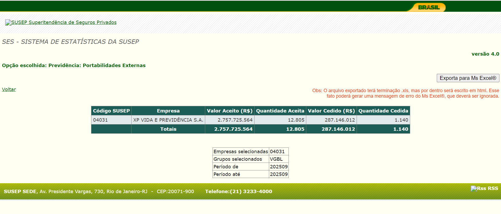

### 5.3 Evidências

**Resultado consolidado dos testes na Silver (`silver.dq_resultados`, 59 testes)**
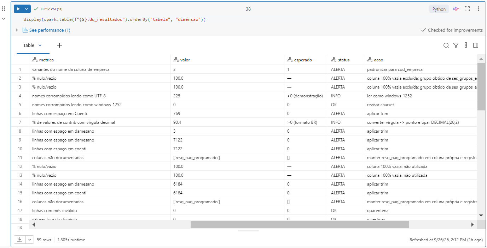

**Encoding: o mesmo arquivo lido como UTF-8 × windows-1252**
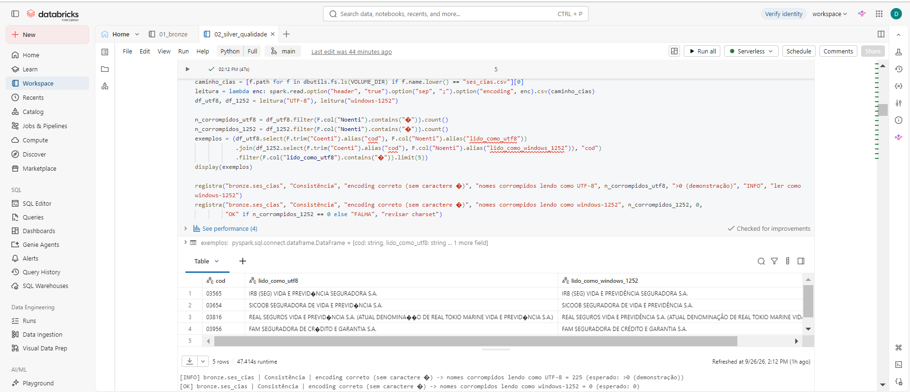

**Nomes de colunas inconsistentes entre arquivos → padronização**
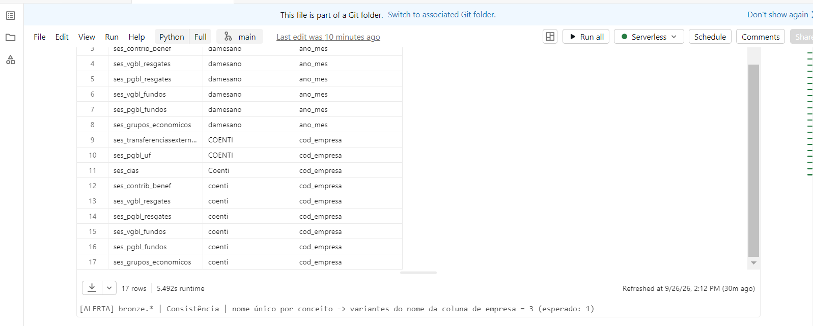

**Colunas 100% vazias em `ses_pgbl_uf`**
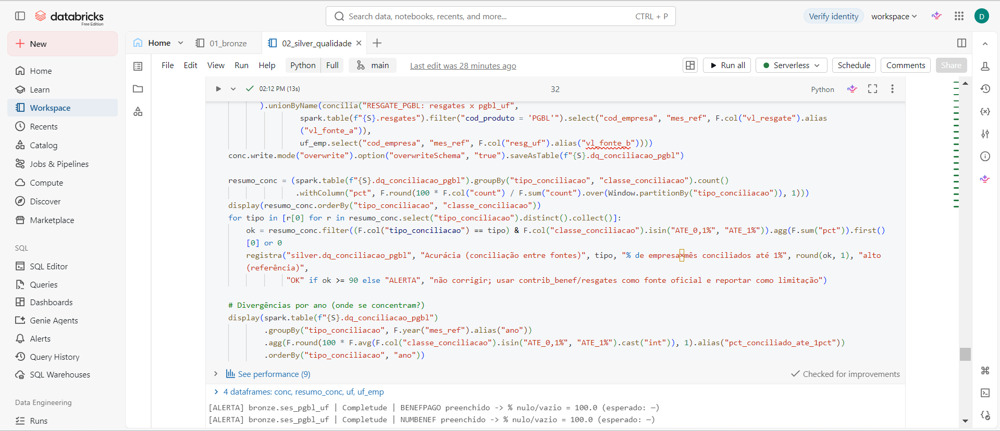

**Duplicatas exatas e soma removida = 0**
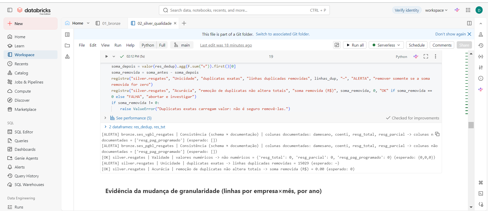
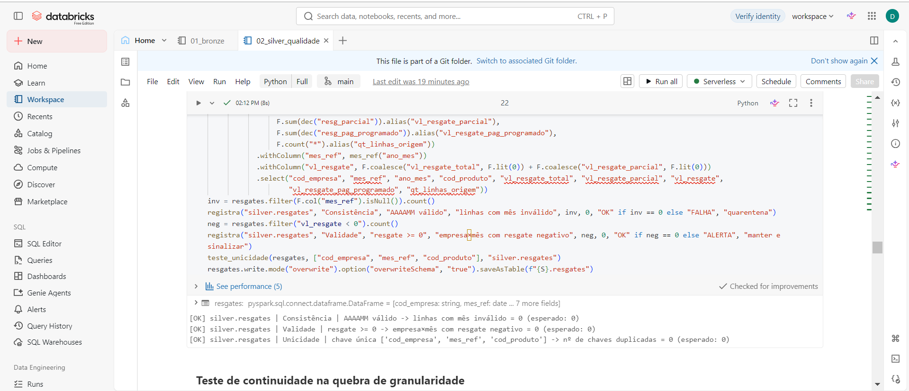

**Mudança de granularidade (linhas por empresa×mês, por ano)**
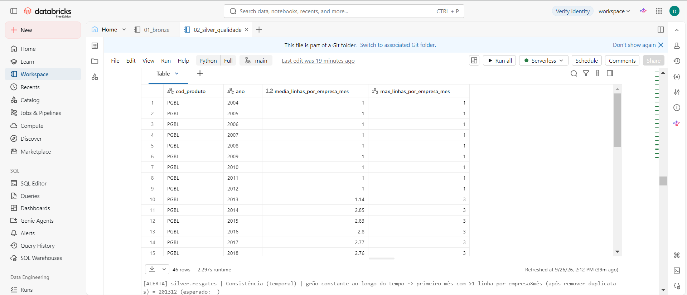

**Continuidade da série na quebra de 12/2013**
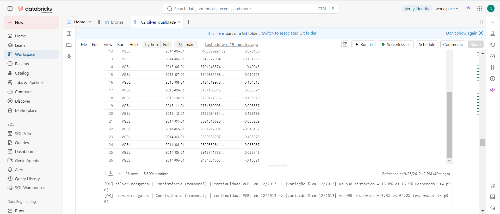

**Portabilidade: domínios, quantidade implausível e simetria de mercado**
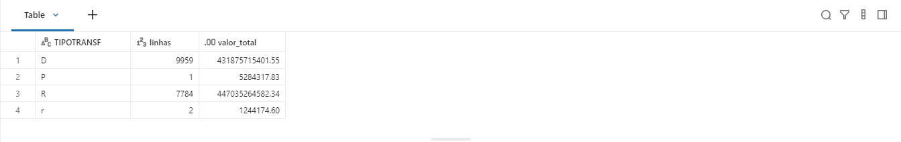
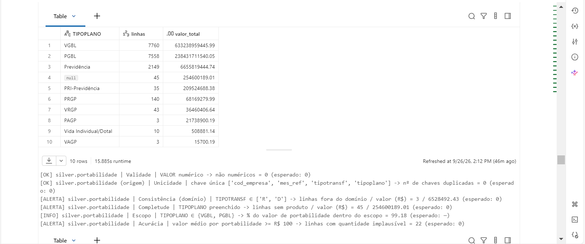
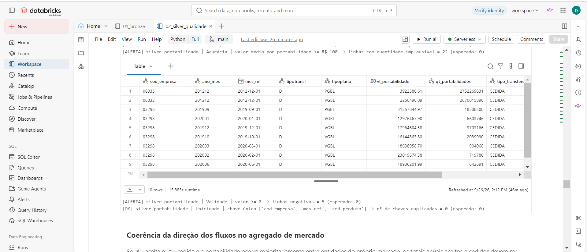
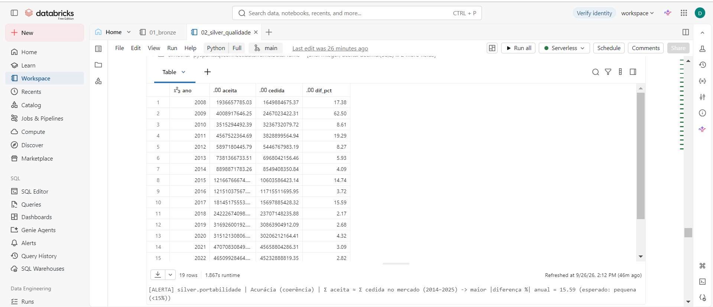

**PMBaC: compatibilidade com a taxa de resgate**
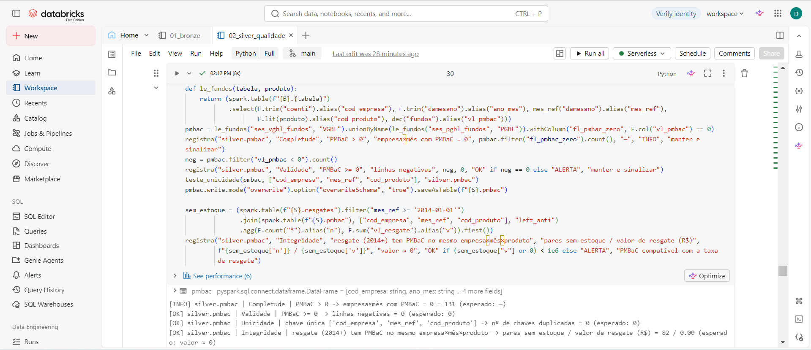

**Conciliação PGBL entre fontes (geral e por ano)**
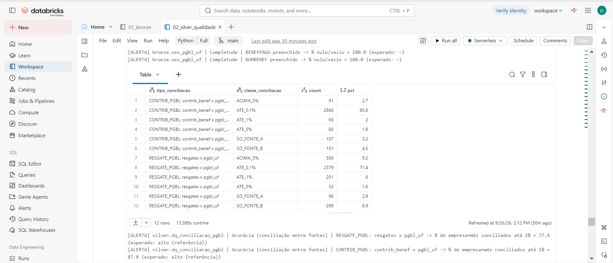
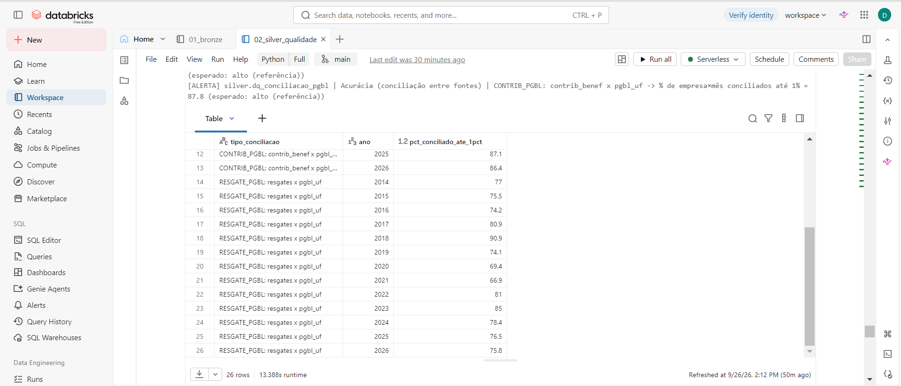

**Integridade referencial e outliers**
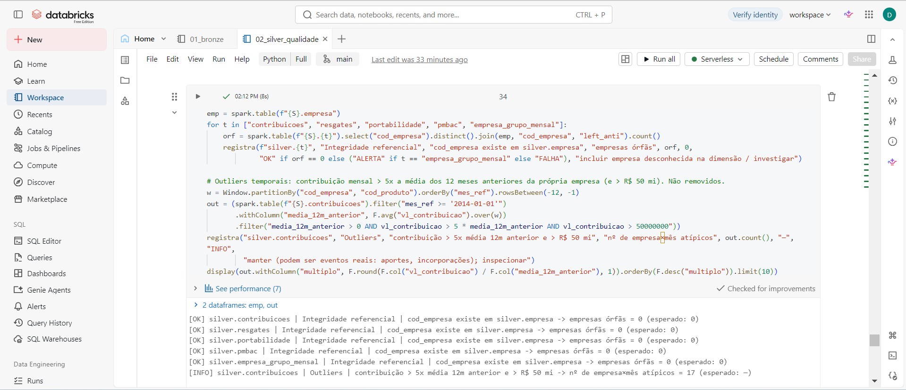
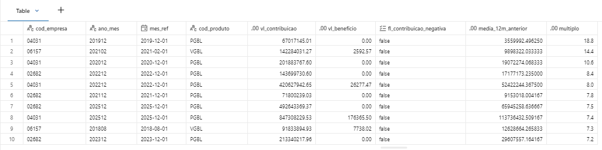

---

## 6. Análise de Dados (Etapa 4.5)

Todas as respostas vêm das consultas Spark SQL do notebook [`04_analises.py`](notebooks/04_analises.py), executadas sobre a camada Gold.

**Convenções**
- valores em **R$ bilhões nominais**, sem correção pela inflação (limitação declarada);
- comparações anuais usam apenas **anos completos (2014–2025)**;
- **2026 só é comparado em base jan–jul** com os mesmos meses dos anos anteriores.

### Q1. Como evoluíram contribuições, resgates e FLCR de VGBL e PGBL?

| Ano | VGBL contrib. | VGBL resgates | **VGBL FLCR** | PGBL contrib. | PGBL resgates | **PGBL FLCR** |
|---|---|---|---|---|---|---|
| 2014 | 71,3 | 33,6 | **37,7** | 8,5 | 5,4 | **3,1** |
| 2016 | 105,0 | 45,0 | **60,0** | 8,9 | 7,1 | **1,8** |
| 2019 | 114,8 | 60,8 | **53,9** | 10,8 | 8,1 | **2,7** |
| 2021 | 126,2 | 92,7 | **33,5** | 11,6 | 9,7 | **2,0** |
| 2023 | 153,3 | 111,9 | **41,4** | 13,9 | 11,4 | **2,6** |
| 2024 | 178,3 | 119,2 | **59,0** | 15,3 | 12,6 | **2,7** |
| 2025 | 139,3 | 135,8 | **3,5** | 15,5 | 14,3 | **1,2** |

*(série anual completa no print abaixo)*

**Comparação jan–jul (base para 2026)**

| jan–jul | VGBL contrib. | VGBL resgates | VGBL FLCR | PGBL FLCR |
|---|---|---|---|---|
| 2023 | 86,1 | 66,5 | 19,6 | −0,8 |
| 2024 | 105,2 | 67,1 | **38,1** | −0,6 |
| 2025 | 92,3 | 78,3 | **14,1** | −2,1 |
| 2026 | 82,8 | 74,8 | **8,0** | −0,8 |

**Resposta**
- **VGBL.** As contribuições cresceram 2,5 vezes entre 2014 e 2024 (de R$ 71 bi para R$ 178 bi). Em 2025 houve uma ruptura: as contribuições caíram 22% (para R$ 139 bi), enquanto os resgates seguiram subindo (R$ 136 bi). O FLCR caiu de **R$ 59,0 bi para R$ 3,5 bi**, e a relação resgate por real contribuído, que variou entre 0,43 e 0,78 de 2014 a 2024, chegou a **0,97**.
- Na série mensal, o FLCR do VGBL ficou **negativo em vários meses do 2º semestre de 2025** e voltou a ser positivo, em nível baixo, a partir do fim de 2025. Em **jan–jul/2026, o FLCR (R$ 8,0 bi) é o menor da série comparável** e as contribuições (R$ 82,8 bi) são menores que as de jan–jul de 2024 e de 2025.
- **PGBL.** O fluxo é bem menor e estável: FLCR positivo em todos os anos, com mínimo de R$ 1,2 bi em 2025. O FLCR de jan–jul do PGBL é **negativo em todos os anos**, porque as contribuições se concentram em **dezembro**, quando o participante aproveita a dedução no IR do ano-calendário. O padrão aparece nos picos de dezembro da série mensal e nos *outliers* da seção de Qualidade.

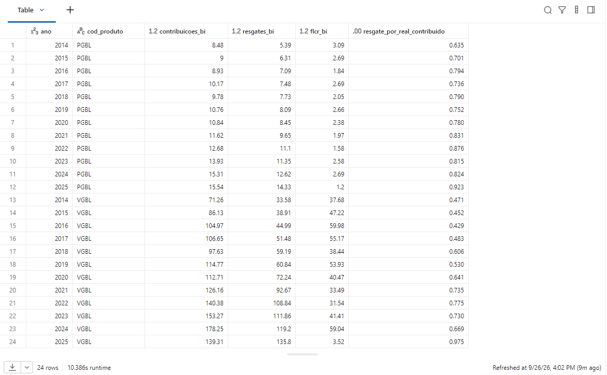
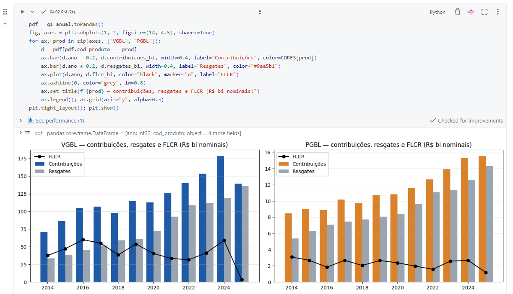
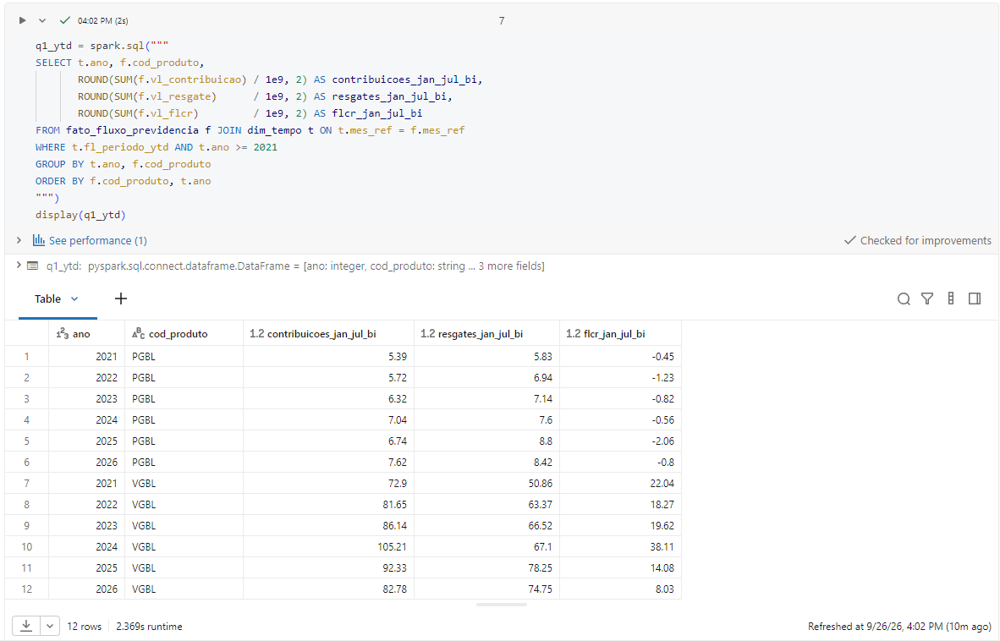
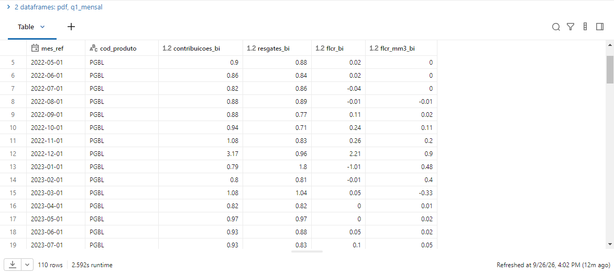
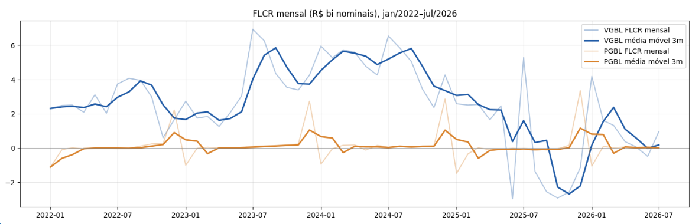

### Q2. Como evoluiu a taxa de resgate (resgates ÷ PMBaC média)?

| | 2014 | 2016 | 2019 | 2020 | 2022 | 2024 | 2025 | jan–jul/2025 | jan–jul/2026 |
|---|---|---|---|---|---|---|---|---|---|
| **VGBL** | 12,5% | 10,4% | **8,7%** | 9,5% | **12,3%** | 10,1% | 10,1% | 6,0% | **5,1%** |
| **PGBL** | 6,3% | 6,3% | 5,3% | 5,3% | 6,2% | 5,6% | 5,6% | 3,6% | **3,0%** |
| PMBaC média VGBL (R$ bi) | 269 | 432 | 697 | 760 | 887 | 1.179 | 1.339 | 1.304 | 1.481 |

**Resposta**
- No VGBL, a taxa caiu de 12,5% (2014) para 8,7% (2019), subiu até 12,3% (2022) e ficou em **10,1% tanto em 2024 quanto em 2025**. Em jan–jul/2026 ela é a **menor da série comparável** (5,1%, contra 6,0% em 2025). No PGBL, a taxa é estável, entre 5,3% e 6,5%.
- **Esse é o resultado que explica a Q1.** Os resgates de VGBL cresceram em reais (R$ 119 bi → R$ 136 bi), mas na **mesma proporção do estoque**, que chegou a R$ 1,3–1,5 trilhão. **A queda do FLCR em 2025–2026 não vem de uma saída proporcionalmente maior de recursos, e sim da redução das contribuições.** Essa leitura só é possível porque o pipeline integra o fluxo (resgates) com o estoque (PMBaC). Olhando só o fluxo, a conclusão seria "os resgates dispararam".

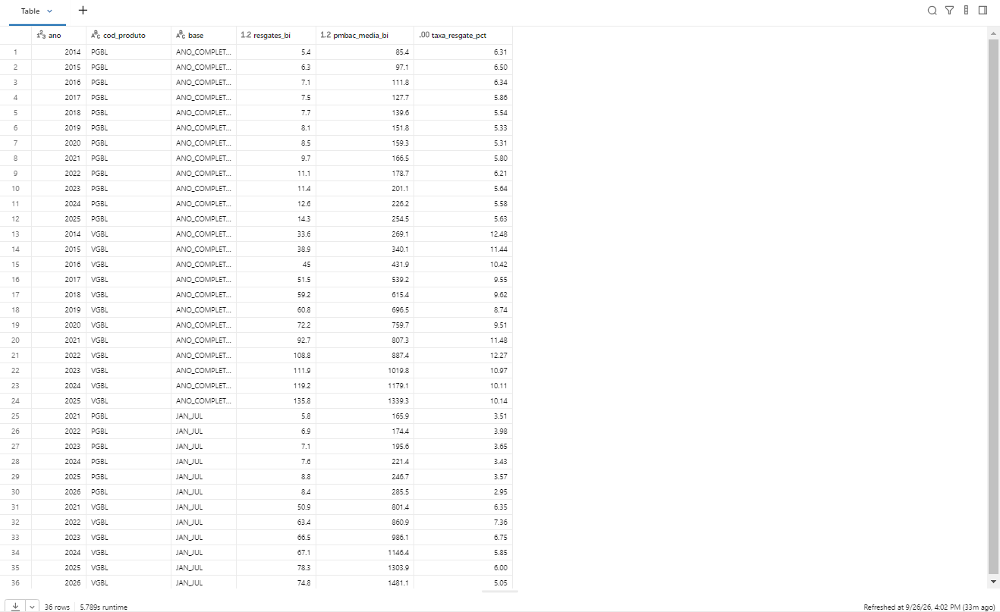
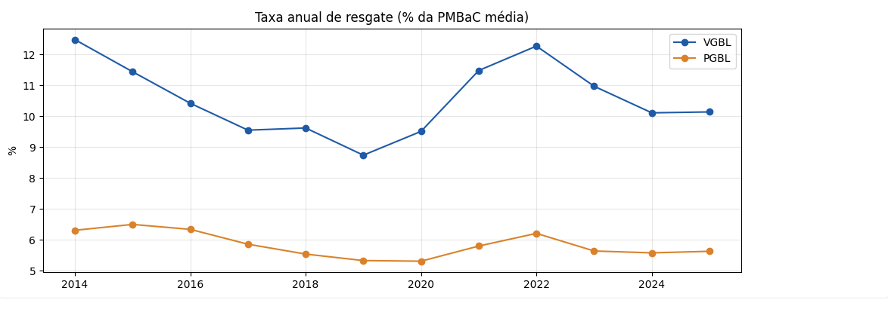

### Q3. Qual o grau de concentração das contribuições entre grupos econômicos?

| | 2014 | 2017 | 2020 | 2023 | 2025 |
|---|---|---|---|---|---|
| **HHI VGBL** | 2.774 | 2.505 | 2.220 | 2.235 | **2.026** |
| Top-5 VGBL | 96,2% | 96,5% | 94,4% | 92,5% | **91,4%** |
| **HHI PGBL** | 1.992 | 2.166 | 1.703 | 1.549 | **1.445** |
| Top-5 PGBL | 84,4% | 88,4% | 83,7% | 80,9% | **78,5%** |

| Posição | VGBL 2014 | VGBL 2025 | PGBL 2014 | PGBL 2025 |
|---|---|---|---|---|
| 1º | Brasil 39,7% | Brasil 30,1% | Brasil 29,1% | **Itaú 24,7%** |
| 2º | Bradesco 28,1% | Bradesco 24,2% | Bradesco 24,9% | Brasil 17,1% |
| 3º | Itaú 19,0% | **Caixa 18,4%** | Itaú 20,9% | Bradesco 14,2% |
| 4º | Zurich Santander* 4,9% | Itaú 10,4% | HSBC 4,8% | **Icatu 12,1%** |
| 5º | Caixa 4,5% | Zurich Santander* 8,2% | Caixa 4,7% | **XP*** 10,3% |

\* empresas classificadas pela SUSEP no grupo genérico 99999 ("outros grupos"), tratadas como unidade econômica própria.

**Resposta.** O mercado continua concentrado, mas **menos concentrado do que em 2014 nos dois produtos**:
- **VGBL:** o HHI caiu 27%, e os 5 maiores ainda somam mais de 90% das contribuições. A liderança continua com os grupos ligados a grandes bancos (Brasil, Bradesco). A Caixa subiu do 5º para o 3º lugar, e o Itaú caiu do 3º para o 4º.
- **PGBL:** a desconcentração foi maior (HHI −27%, top-5 de 84% para 79%). O Itaú assumiu a liderança, e **Icatu e XP entraram entre os 5 maiores**, no lugar de HSBC e Caixa.

Como referência usual, as diretrizes de concentração dos EUA (2023) classificam HHI acima de 1.800 como mercado altamente concentrado. Por esse critério, o VGBL permanece nessa faixa e o PGBL saiu dela. O uso da **atribuição temporal de grupo** foi essencial aqui: com o grupo "atual" retroativo, as participações históricas de empresas que trocaram de controlador ficariam no grupo errado.

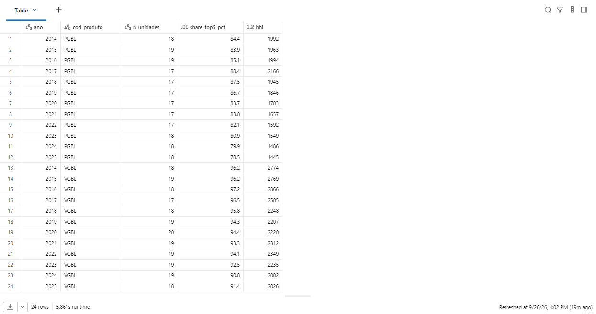
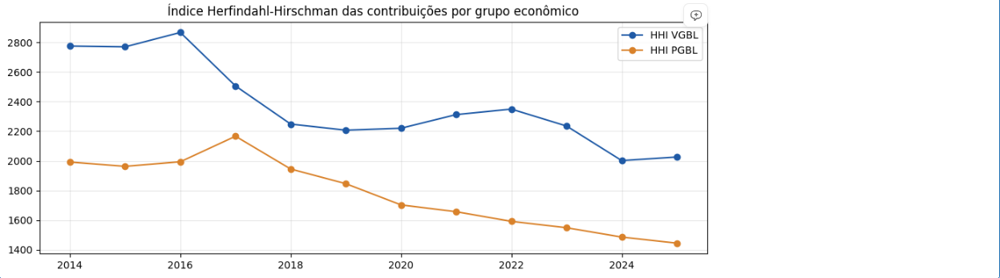
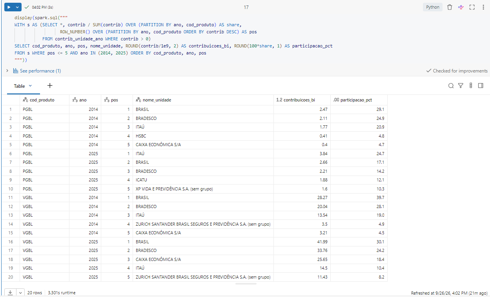

### Q4. Qual o saldo líquido de portabilidade por unidade econômica?

Primeiro, a verificação de mercado. O saldo total (aceita − cedida) é pequeno diante do volume portado: em 2025, foram R$ 67,8 bi aceitos contra R$ 65,9 bi cedidos, um saldo de +R$ 1,9 bi (seção 5, item 19). O volume portado mais que **dobrou** entre 2019 (R$ 31 bi) e 2025 (R$ 67 bi).

| 2025 (VGBL+PGBL) | Aceita | Cedida | **Saldo líquido** | Contribuições | Saldo ÷ contribuições |
|---|---|---|---|---|---|
| XP Vida e Previdência* | 22,9 | 5,9 | **+17,0** | 4,4 | 391% |
| Banco Pactual | 9,4 | 1,5 | **+7,8** | 3,4 | 234% |
| Itaú | 12,0 | 4,5 | **+7,5** | 18,3 | 41% |
| Safra | 3,0 | 2,1 | **+0,9** | 1,8 | 49% |
| Caixa | 2,4 | 3,9 | **−1,5** | 26,1 | −6% |
| Bradesco | 5,2 | 8,8 | **−3,6** | 36,0 | −10% |
| Sul América | 1,8 | 6,4 | **−4,6** | 0,7 | −665% |
| Brasil | 3,0 | 12,9 | **−9,9** | 44,7 | −22% |
| Icatu | 4,2 | 14,2 | **−10,0** | 5,7 | −177% |

**Resposta**
- A portabilidade **redistribui recursos de forma concentrada**. Três unidades receberam, em termos líquidos, R$ 32,4 bi em 2025: **XP (+17,0 bi), Banco Pactual (+7,8 bi) e Itaú (+7,5 bi)**. Os maiores cedentes líquidos foram **Icatu (−10,0 bi), Brasil (−9,9 bi), Sul América (−4,6 bi) e Bradesco (−3,6 bi)**.
- Para XP e Banco Pactual, o saldo de portabilidade é **2 a 4 vezes maior que as contribuições** do ano: a portabilidade é o principal canal de entrada de recursos dessas unidades.
- Para os grandes grupos bancários (Brasil, Bradesco, Caixa), o saldo negativo representa de 6% a 22% das contribuições: é relevante, mas não domina o fluxo.
- O saldo positivo do Banco Pactual é **recente e persistente**: ficou próximo de zero até 2019 (R$ 0,3 bi), passou de R$ 0,9 bi em 2020 para R$ 4,2 bi em 2021 e chegou a R$ 7,8 bi em 2025.
- *Interpretação, não testada:* os maiores receptores líquidos (XP, Banco Pactual) são grupos associados a plataformas de investimento, o que sugere uma migração de reservas dos canais bancários tradicionais para essas plataformas. Os dados do SES não trazem o canal de distribuição, portanto essa leitura é uma hipótese.

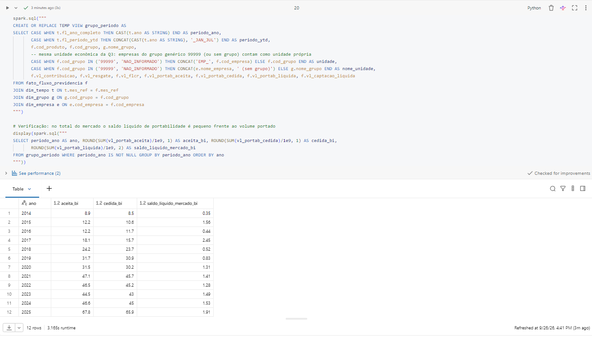
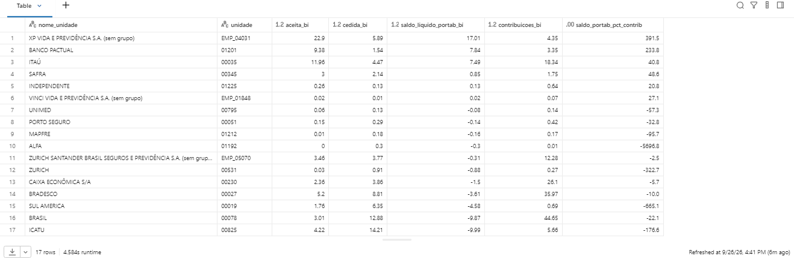
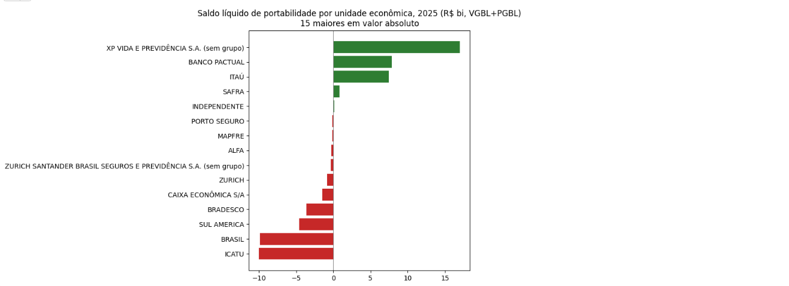
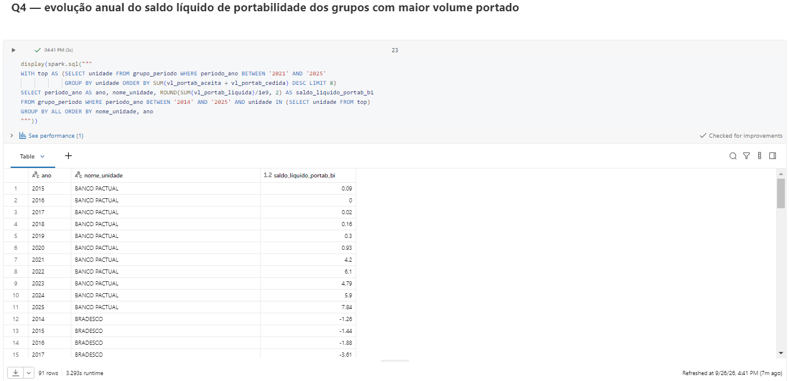

### Q5. Quanto o resultado e a posição mudam do FLCR para a captação líquida?

| 2025 (VGBL+PGBL) | FLCR | Saldo portab. | **Captação líquida** | Posição FLCR | Posição captação |
|---|---|---|---|---|---|
| XP Vida e Previdência* | −0,74 | +17,01 | **+16,27** | 18º | **1º** |
| Itaú | +4,15 | +7,49 | **+11,63** | 2º | 2º |
| Banco Pactual | +1,05 | +7,84 | **+8,89** | 4º | 3º |
| Caixa | +5,01 | −1,50 | **+3,51** | **1º** | 4º |
| Icatu | +1,27 | −9,99 | **−8,72** | 3º | **18º** |
| Brasil | −5,21 | −9,87 | **−15,08** | 19º | 19º |

**Resposta.** Das **19 unidades** com contribuições em 2025, **15 mudam de posição** e **5 mudam de sinal** quando a portabilidade é incluída:
- A **XP** tem FLCR negativo (18º lugar) e é a **1ª em captação líquida**.
- A **Icatu** tem o 3º maior FLCR e cai para o **18º lugar**.
- A **Caixa** lidera pelo FLCR (entrada de contribuições) e cai para 4º.
- O **Brasil** é o último nas duas métricas: resgates maiores que contribuições **e** saída líquida por portabilidade.

A conclusão é metodológica e de negócio: **o ranking de "quem cresce" depende da definição da métrica**. O FLCR mede a relação da entidade com seus próprios participantes (aportes e saques). A captação líquida inclui a disputa entre entidades pelas reservas já acumuladas. Deixar as duas métricas explícitas, com nomes distintos (seção 1), evita comparações enganosas.

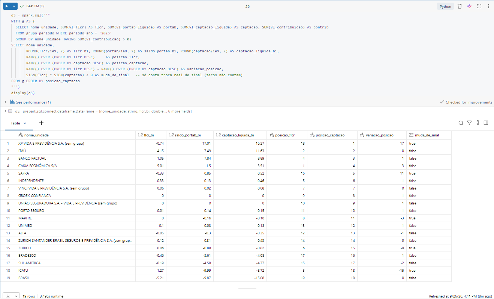
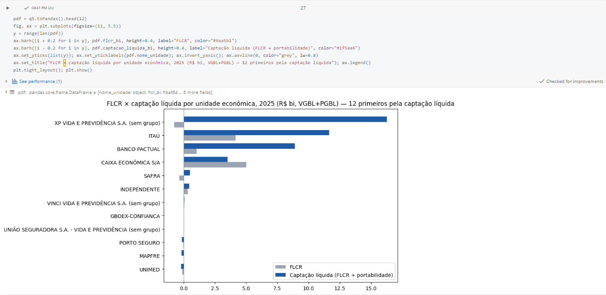
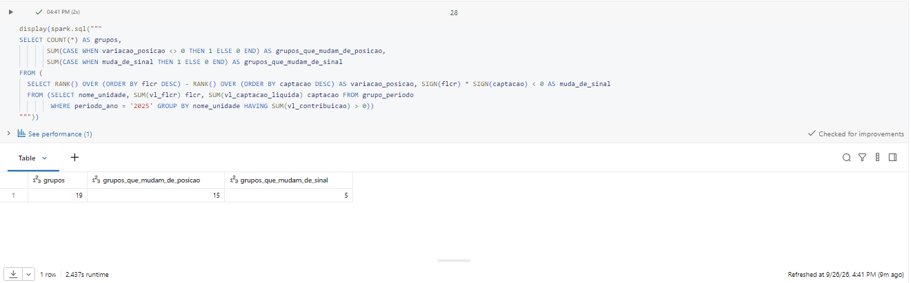

### Discussão geral

O problema central era a falta de uma base integrada e auditável que permitisse acompanhar entradas e saídas de recursos de VGBL e PGBL e distribuí-las entre grupos econômicos. O pipeline resolveu isso, e as cinco perguntas contam uma história coerente:

1. **2014–2024 foi uma década de crescimento.** As contribuições de VGBL cresceram 2,5 vezes e a PMBaC dos dois produtos passou de ~R$ 350 bi para ~R$ 1,6 tri (médias anuais).
2. **Em 2025 houve uma ruptura no fluxo de entrada, não na saída.** O FLCR do VGBL caiu 94%. A taxa de resgate (Q2), porém, ficou estável (10,1%). O que mudou foi o volume de contribuições. Em jan–jul/2026 o quadro persiste: contribuições menores e taxa de resgate na mínima da série.
3. **A estrutura competitiva está mudando.** A concentração caiu (Q3), e a portabilidade (Q4) move dezenas de bilhões por ano **dos grandes grupos bancários para unidades como XP, Banco Pactual e Itaú**.
4. **A escolha da métrica muda as conclusões** (Q5). Sem separar FLCR e portabilidade, o maior receptor de recursos do mercado em 2025 (XP) apareceria com resultado negativo.

**Contexto regulatório de 2025, com as devidas separações**
- **Dado (SES):** as contribuições de VGBL caíram de R$ 178,3 bi (2024) para R$ 139,3 bi (2025), e o FLCR mensal ficou negativo em vários meses do 2º semestre de 2025.
- **Contexto externo:** o Decreto nº 12.466/2025 (22/05/2025) instituiu IOF sobre aportes em seguros com cobertura por sobrevivência (VGBL). O Decreto nº 12.499/2025 (11/06/2025) fixou 5% sobre aportes acima de R$ 300 mil por seguradora em 2025 e de R$ 600 mil por ano a partir de 2026. Houve suspensão pelo Decreto Legislativo nº 176/2025 (27/06/2025) e restabelecimento cautelar pelo STF em 16/07/2025.
- **Interpretação:** a queda das contribuições de VGBL **coincide temporalmente** com essa mudança tributária.
- **Causalidade: não é afirmada.** O trabalho não controla juros, renda, comportamento de portabilidade nem outros fatores. Estimar esse efeito exigiria metodologia econométrica, fora do escopo deste MVP de Engenharia de Dados.

**Qualidade e confiabilidade das respostas.** As respostas se apoiam em uma base auditada:
- 59 testes na Silver e 24 na Gold, com 0 falhas;
- conservação de totais Silver → Gold (diferença R$ 0,00);
- direção da portabilidade confirmada na fonte oficial;
- conciliação de contribuições PGBL entre duas fontes SUSEP de 86–88%.

As principais ressalvas são os valores nominais e a portabilidade de mercado não exatamente simétrica (+R$ 1,9 bi em 2025).

---

## 7. Autoavaliação

**Objetivos atingidos.** Os cinco objetivos específicos foram cumpridos, e **as cinco perguntas de negócio foram respondidas** com dados da camada Gold:
1. ingestão dos 9 arquivos preservando o original, com metadados e teste de contagem (9/9);
2. diagnóstico e tratamento documentado de 19 problemas de qualidade reais, sem alteração silenciosa de valores (quarentena e *flags*);
3. integração de contribuições, resgates, portabilidade, estoque e grupo econômico com atribuição temporal;
4. esquema estrela com PK/FK no Unity Catalog, catálogo com domínio calculado a partir dos dados e linhagem automática;
5. análises em Spark SQL.

**Principais dificuldades**
- **Granularidade oculta.** A mudança de 1 para até 3 linhas por chave em 12/2013, sem coluna identificadora, só foi percebida perfilando os dados. Uma deduplicação ingênua teria apagado resgates legítimos. A solução foi separar duplicatas exatas (removidas só após provar soma zero) de sub-linhas (somadas) e validar com um teste de continuidade.
- **Domínios não documentados.** A documentação do SES diz apenas "Aceita ou Cedida" para `TIPOTRANSF`. A direção R/D teve de ser confirmada na consulta oficial do SES online, e os códigos `r` e `P` ficaram em quarentena.
- **Unidade econômica.** Na primeira execução, as empresas do grupo genérico 99999 foram excluídas das perguntas Q4 e Q5, o que deixava de fora o maior receptor de portabilidade do mercado (XP, +R$ 17 bi). O erro foi identificado na revisão dos resultados e corrigido para usar a mesma regra da Q3 (a empresa como unidade própria), o que mostra a importância de validar os resultados contra o conhecimento do negócio.
- **Ambiente.** O Databricks Free Edition restringe o acesso à internet, então a ingestão foi feita por upload manual para Volume. O prazo curto também exigiu reduzir o escopo (tradicional, IPCA e UF ficaram de fora).

**Limitações**
- Valores **nominais**: as comparações de longo prazo incluem o efeito da inflação.
- **VGBL não tem abertura por UF** nas tabelas de previdência do SES, então a análise geográfica ficou fora do escopo.
- Conciliação PGBL entre fontes parcial: 86–88% nas contribuições e 71–77% nos resgates.
- Soma de mercado da portabilidade não exatamente simétrica (diferença residual atribuída, como hipótese, a fluxos com entidades fora do escopo).
- O limiar de quantidade implausível (R$ 100 por portabilidade) é heurístico.
- **Não há inferência causal**: a associação com o IOF de 2025 é apenas temporal.

### Trabalhos futuros
- Correção monetária pelo IPCA (BCB/SGS 433).
- VGBL por UF via `SES_UF2.csv` (ramos 0994/1392) e análise per capita com população do IBGE.
- Previdência tradicional (`ses_prev_trad_resgates.csv`).
- Quantidade de participantes (`ses_quantprev_part.csv`), após resolver estoques negativos e sub-linhas.
- Orquestração como *Job* do Databricks com ingestão incremental de novas bases do SES (os *snapshots* já são identificados por `_data_geracao_base_ses`).
- Análise de eventos regulatórios (ex.: IOF sobre VGBL em 2025) com metodologia causal apropriada.

---

## Referências
- SUSEP — Sistema de Estatísticas da SUSEP (SES), base completa para download e documentação das tabelas: https://www2.susep.gov.br/menuestatistica/ses/principal.aspx
- Caixa Seguridade — Relatório de desempenho mensal SUSEP (metodologia de captação líquida sobre o SES): https://api.mziq.com/mzfilemanager/v2/d/3972906b-e50b-4f74-ab74-4d0d32125d11/ba4d6c1d-5f10-4cf0-9d59-ce0ae04abd2a?origin=2
- Decreto nº 12.499, de 11/06/2025 (IOF sobre seguros com cobertura por sobrevivência): https://www.planalto.gov.br/ccivil_03/_ato2023-2026/2025/decreto/d12499.htm
- Demarest Advogados — STF restabelece a eficácia do Decreto nº 12.499/2025 (decisão de 16/07/2025): https://www.demarest.com.br/majoracao-do-iof-stf-publica-decisao-cautelar-restabelecendo-a-eficacia-do-decreto-no-12-499-2025/
- Decreto nº 8.777/2016 — Política de Dados Abertos do Poder Executivo federal.
- Databricks — Free Edition limitations: https://docs.databricks.com/aws/en/getting-started/free-edition-limitations
- Databricks — Medallion architecture; Unity Catalog (constraints, comments e data lineage): https://docs.databricks.com

---
